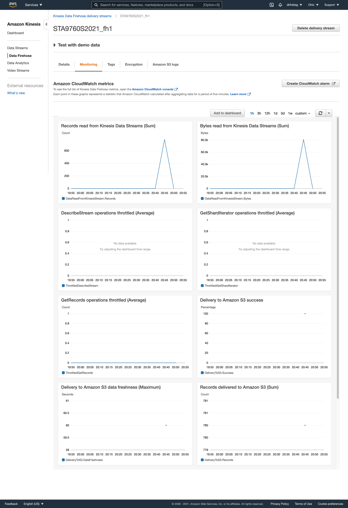

## Streaming Finance Data with AWS Lambda

**Project Objective:** Provision a Lambda function to generate near real-time finance data records for interactive querying.

**Technologies Used:**

- AWS Kinesis (data stream and data firehose)
- AWS S3
- AWS Glue
- AWS Lambda (Python, yfinance, Boto3, pandas)
- AWS Athena (SQL)
- Python Jupyter Notebook (Seaborn, pandas)

**Project Configuration/Run Steps:**

1. Configure Kinesis data stream
2. Configure Kinesis data firehose
	- Input: Kinesis data stream
	- Output: S3 bucket (you may need to create this too)
3. Configure Glue crawler to crawl the S3 bucket
4. Configure Lambda function to retrieve stock data and push it to the Kinesis data stream
5. Run the Lambda function
6. Confirm that the data has appeared in the S3 bucket
7. Run the Glue crawler on the S3 bucket
8. Query the database and table created by the crawler using Athena
9. Download the results of the query to results.csv
10. Read results.csv into a Jupyter Notebook and create visualizations

-

**Amazon Kinesis Data Stream Monitoring:**

